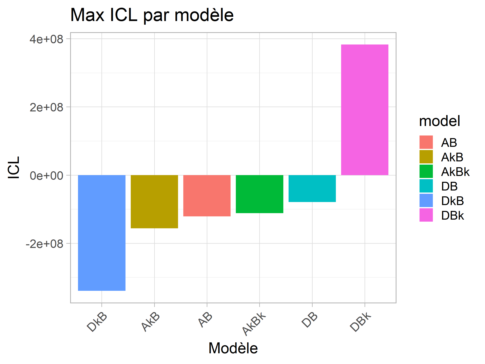
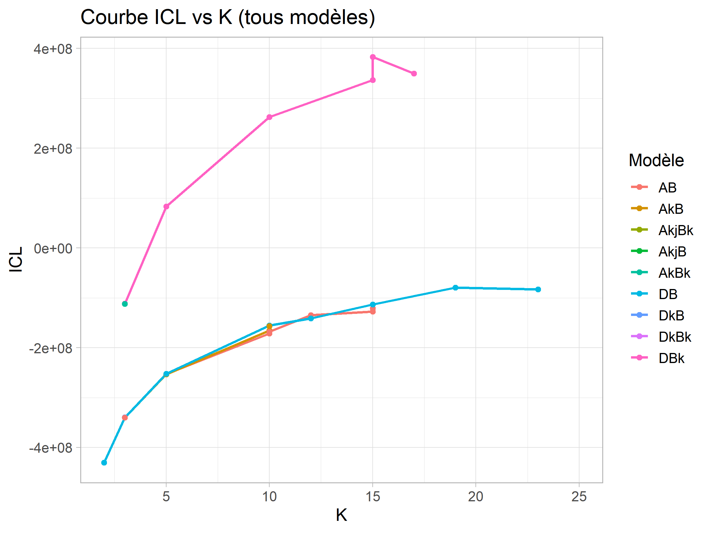

# 🌌 Classification non supervisée des spectres SDSS avec FisherEM

Ce projet s’inspire de l’étude menée par **M. Didier Fraix-Burnet et al.**, qui appliquait l’algorithme **FisherEM** à la classification automatique de spectres de galaxies en combinant modélisation par mélanges gaussiens et réduction de dimension discriminante.  
Nous proposons ici une ré-implémentation de cette méthode en utilisant des **données standardisées** issues de la même base de données **SDSS** (Sloan Digital Sky Survey). Cette approche vise à améliorer la reproductibilité, la robustesse et la comparabilité des résultats.  
Pour plus d’informations sur l’étude originale, [voir l'article](https://ui.adsabs.harvard.edu/abs/2021A%26A...649A..53F/abstract).

---

## 🔍 Objectif

Déterminer des regroupements cohérents dans un jeu de spectres de galaxies, en identifiant des **sous-classes spectrales** selon des critères structurels et physiques (formes de raies, intensité, décalage spectral, etc.), **sans connaissance préalable des classes**.

---

## 🧪 Données utilisées

- **Source** : Sloan Digital Sky Survey (SDSS DR14)
- **Format** : Matrice `n × p`  
  - `n` = nombre de spectres (~302 248)
  - `p` = nombre de longueurs d’onde (~1437)
- **Prétraitement** :
  - Centrage/réduction (standardisation).
  - Interpolation et normalisation sur une plage spécifique (ex. : 6400–6800 Å).

---

## 🧠 Méthode FisherEM

L’algorithme **FisherEM** repose sur trois idées clés :

1. **Modélisation** : chaque cluster est un mélange gaussien dans un sous-espace discriminant
2. **Réduction de dimension** : l’espace projeté de dimension `d = min(K - 1, p - 1)` est obtenu par maximisation du critère de **Fisher** (ratio interclasse/intraclasse)
3. **Estimation par EM** : les probabilités d’appartenance sont ajustées à chaque itération

---

## ⚙️ Pipeline de classification

1. **Chargement des spectres SDSS**
2. **Application de FisherEM sur plusieurs configurations (nombre de classes K et modèles prédéfinis)**  
3. **Visualisation des graphes de comparaison entre les classifications**
Les résultats de classification sont comparés visuellement à l’aide de la fonction `FEMrecap()`, qui affiche :
  - l’évolution du critère ICL selon `K`
  - la projection des données dans l’espace discriminant

  
  

4. **Sélection de l’optimum** selon le critère `ICL`
5. **Affichage des dispertions de chaque sous-classe** avec `mspsplit_paper()`  
Pour chaque sous-classe, `mspsplit_paper()` affiche :
  - La courbe moyenne du spectre
  - Les bandes de dispersion (± écart-type ou quantiles)

6. **Sous classification de chaque classe de l'optimum** mêmes étapes que la classification 

---

## 📚 Modèles disponibles dans FisherEM

La classification est testée sur plusieurs modèles gaussiens :
'DkBk','DkB','DBk','DB','AkjBk','AkjB','AkBk','AkB','AB'
- `"AkBk"`, `"AkB"`, `"AkjB"`, `"AkjBk"`,`"AB"`
- `"DB"`, `"DBk"`, `"DkB"`, `"DkBk"`

Ces modèles diffèrent par la structure de covariance utilisée dans l’espace discriminant.

---

## 📊 Résultats

- Production de 15 classifications (une par classe principale SDSS)
- Visualisation de la structure interne de chaque classe via :
  - Moyenne des spectres par sous-groupe
  - Bandes de dispersion (quantiles ou écart-type)
- Fusion des figures individuelles dans un seul montage global (`sous_classification_finale.pdf`)

---

## 🖼️ Visualisation

Chaque sous-classe est représentée par :
- Une **courbe moyenne**
- Des **bandes de dispersion** (± écart-type ou quantiles 10–90%)
- Un titre du type **"Classe X = ..."**

Un script permet de fusionner automatiquement les 15 visualisations en une seule image récapitulative, facilitant la lecture et l’interprétation.

---

## 📦 Packages R utilisés

- `FisherEM` : algorithme principal
- `scales` : transparence pour les courbes
- `magick` : fusion d’images PDF
---

## ✏️ Auteurs

- **Racim Zenati** – Étudiant en cycle ingénieur à l’INP-ENSIMAG (2éme année licence informatique au moment du stage)
- Stage de recherche réalisé au sein de l’**IPAG** (Institut de Planétologie et d’Astrophysique de Grenoble),  
  sous la supervision de **Didier Fraix-Burnet** (chercheur CNRS) et **Hugo Chambon** (doctorant en astrophysique)
---

➡️ [Voir le pipeline FisherEM SDSS complet](FisherEM_pipeline.md)
